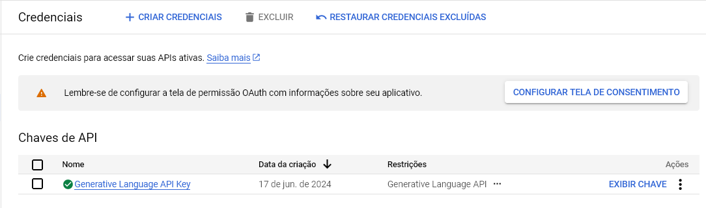

# Assistente Virtual para Chamadas de Voz

## Como Funciona?

O código captura qualquer áudio proveniente do sistema, transcreve-o para texto e, posteriormente, envia-o para uma inteligência artificial (neste caso, a Gemini, do Google), gerando uma resposta para o áudio capturado.

## Para que Serve?

Você pode fingir ser o Google Assistente em qualquer tipo de chamada onde estejam você e outra pessoa (calls do Discord, ligações, chat de voz em jogos, reuniões).

## Como Instalar

Primeiramente, entre no Painel de Controle do Windows e siga os seguintes passos: Hardware e Sons > Som > Gravação > Mixagem Estéreo > Clique com o botão direito > Habilitar.

Em seguida, clone o repositório e baixe as dependências necessárias listadas no topo do arquivo. Provavelmente você também precisará instalar o `ffmpeg`.

Após isso, gere uma chave de API no site do Google, seguindo o exemplo:

Adicione essa chave no arquivo `.env`.

Por fim, execute o código com `python main.py`.